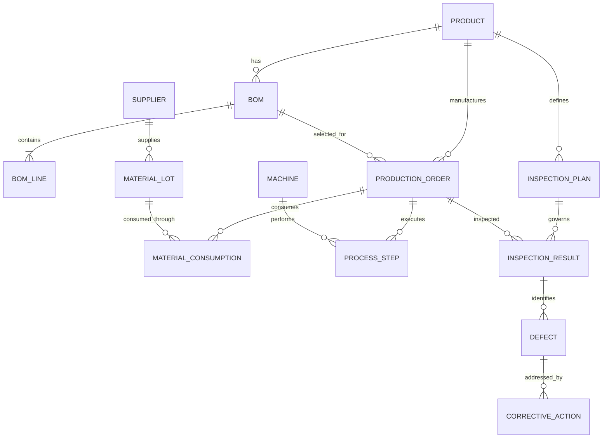

# YottaFlex AI – Entity Relationship Diagram

```mermaid
erDiagram
    PRODUCT ||--o{ BOM : has
    BOM ||--|{ BOM_LINE : contains

    PRODUCT ||--o{ PRODUCTION_ORDER : manufactures
    BOM ||--o{ PRODUCTION_ORDER : selected_for

    SUPPLIER ||--o{ MATERIAL_LOT : supplies

    PRODUCTION_ORDER ||--o{ MATERIAL_CONSUMPTION : consumes
    MATERIAL_LOT ||--o{ MATERIAL_CONSUMPTION : consumed_through

    PRODUCTION_ORDER ||--o{ PROCESS_STEP : executes
    MACHINE ||--o{ PROCESS_STEP : performs

    PRODUCT ||--o{ INSPECTION_PLAN : defines
    INSPECTION_PLAN ||--o{ INSPECTION_RESULT : governs
    PRODUCTION_ORDER ||--o{ INSPECTION_RESULT : inspected

    INSPECTION_RESULT ||--o{ DEFECT : identifies
    DEFECT ||--o{ CORRECTIVE_ACTION : addressed_by
```
